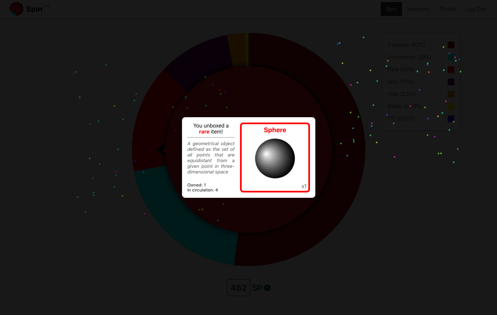
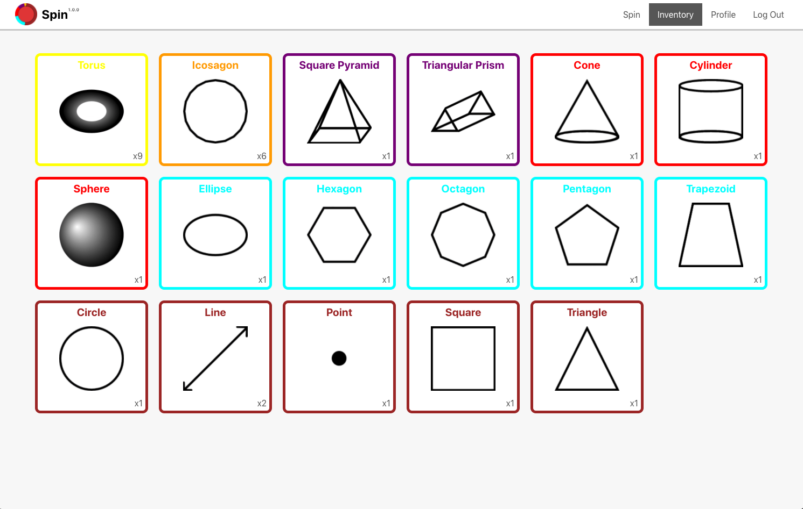
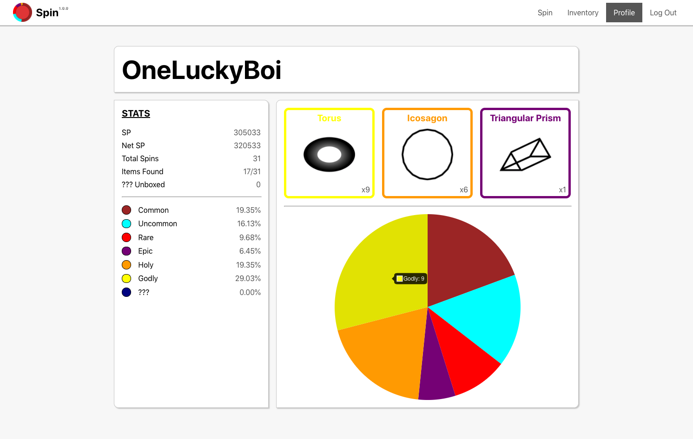

# Spin

An online economy game where players can unbox, buy, and list items. They can also check the profile and stats of themselves and other players.

## Features
- Spinner to unbox items 
- Prize display (with fireworks!)
- Inventory system
- Marketplace 
- Ability to buy items from other players and list items for sale 
- Profile with stats, a showcase of best owned items, and a pie chart of rarity percentages 
- 31 available items to collect (each with an image and description) 
- Real-time UI updating

## Upcoming Features 
- Deployment!
- Leaderboard 
- Market info for each item (recent sale price, units sold, etc.)
- Profile customization 
- Market and inventory filtering 
- More stats

## Images 

*All item images and descriptions were made from scratch.*
