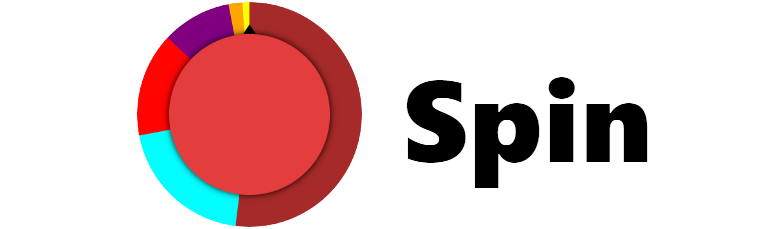
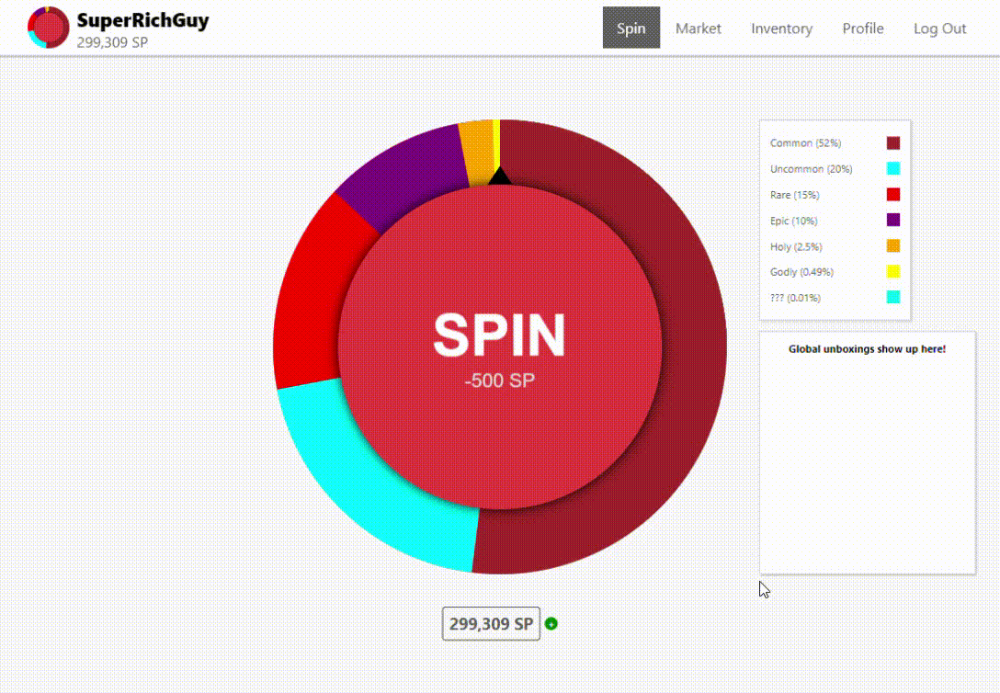
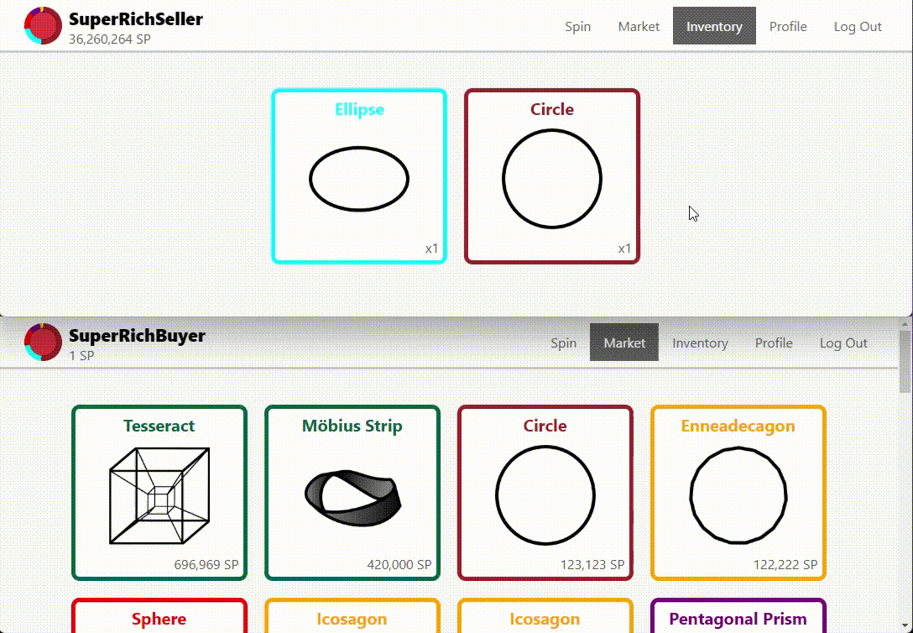
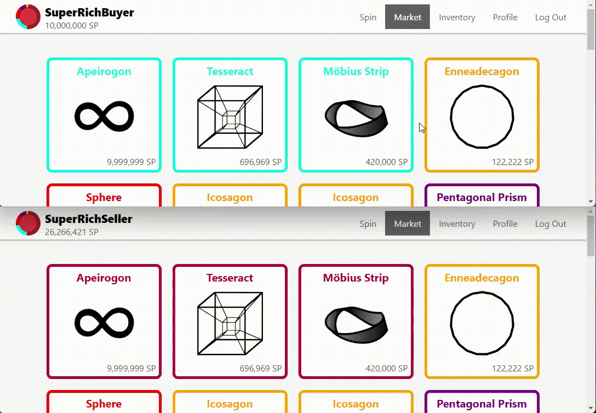

&nbsp;

  <a href="https://spin.jerrytq.com">
    <picture>
      <source media="(prefers-color-scheme: dark)" srcset="docs/images/logo-darkmode.png">
      
    </picture>
  </a>

&nbsp;

## Introduction
Spin is a full stack web application built primarily with React and Django. It aims to emulate a basic online economy by allowing players to spin a wheel to obtain collectibles, which can later be sold on the market to other players using a fictional currency called *SP* (Spin Points).

Try it out at [spin.jerrytq.com](https://spin.jerrytq.com)!

## Schematics
Spin consists of 3 major components: 
1. A frontend built using React and hosted on Vercel
2. A backend built using Django and hosted on Heroku
3. An independent Socket.IO server hosted on Replit

## Demonstrations
&nbsp;

  <kbd>
    
  </kbd>

  Spinning a common item

&nbsp;

  <kbd>
    
  </kbd>

  Spinning a ??? item

&nbsp;

  <kbd>
    
  </kbd>

  Listing an item onto the market for sale 
  (The market updates in real time with Socket.IO.)

&nbsp;

  <kbd>
    
  </kbd>

  Buying an item off the market 
  (The market and the seller's SP both update in real time with Socket.IO.)

&nbsp;

## Upcoming Features
- Market info for each item (historical sale price, units sold, etc.)
- Market and inventory filtering 
- Profile customization 
- Options menu
- Leaderboard
- More items 
- More stats
- Trading
- Sound
